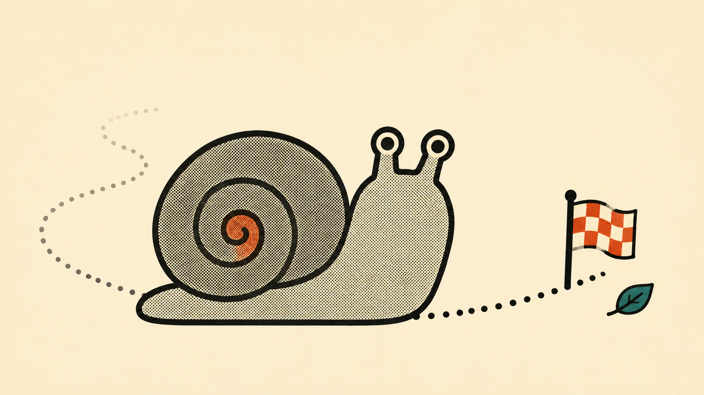
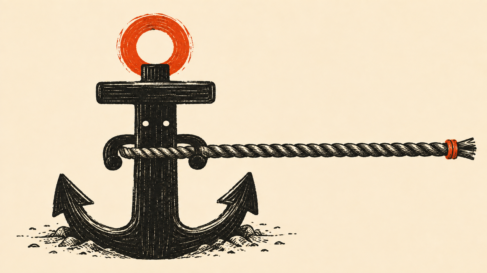
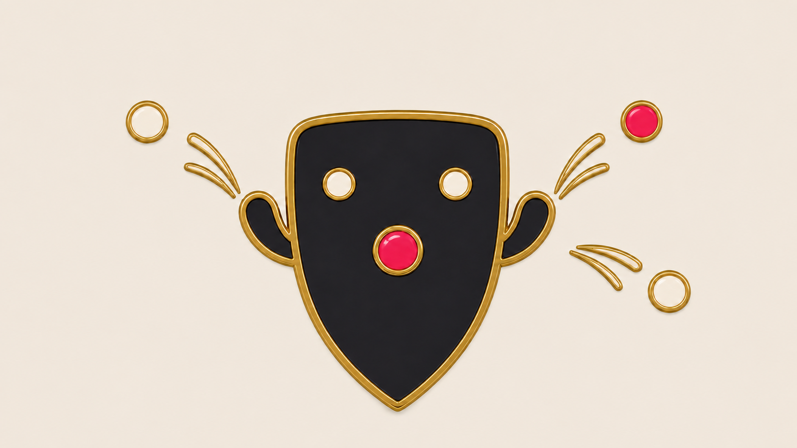
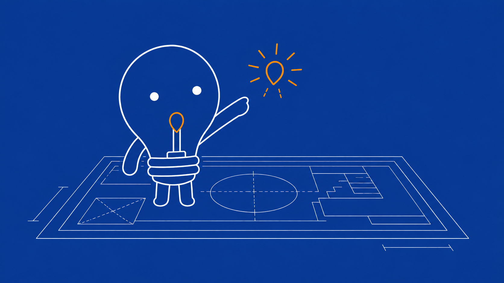
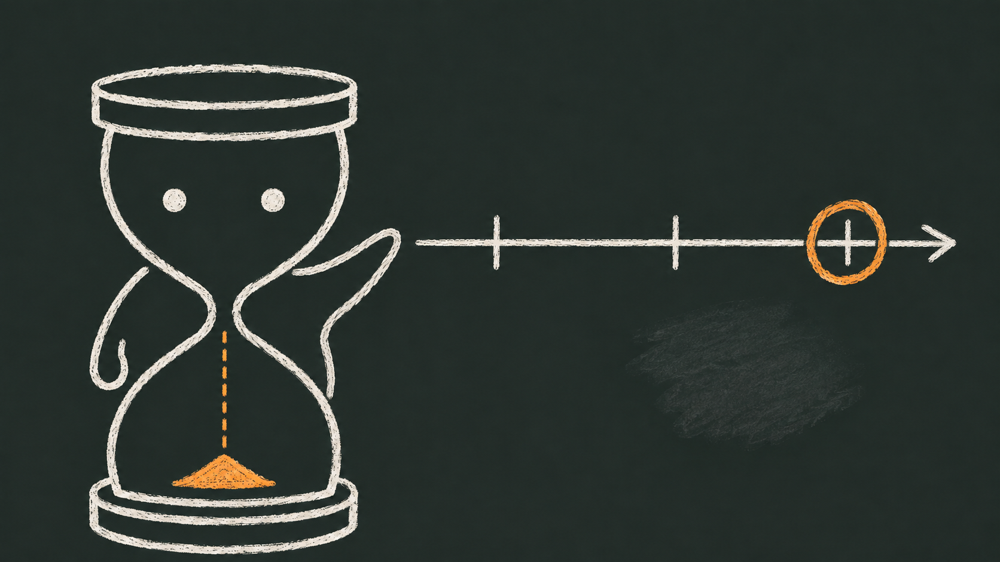
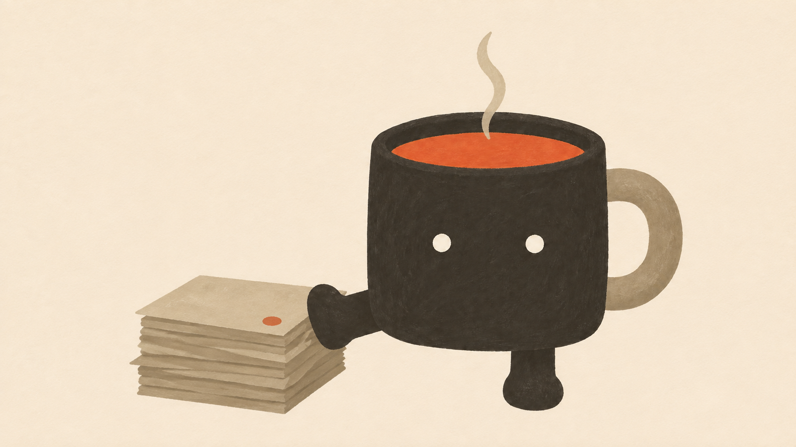

# lukis-characters

Community **character packs** for [lukis](https://github.com/madearga/lukis-skill/tree/main/skills/lukis) —
the editorial-illustration agent skill. A pack is a recurring mascot: a
written spec (`character.md`) plus a canonical model sheet (`reference.png`)
that keeps the character on-model across every image the skill generates.

The skill ships with **Ciko** (a deadpan house gecko) built in — no pack
needed. This repo is for *additional* characters: install one, set it as
your default, or switch per run.

## Packs

| Pack | In action | Look | Author | What it is |
|---|---|---|---|---|
| [`ciko`](packs/ciko/) |  | sablon | I Made Arga Swarsa | A small house gecko (cicak): the quiet regular on the wall. Deadpan patience, showing up, and the work that gets done without announcement. _aka `cicak`, `gecko`, `house-gecko`, `lizard`._ ([model sheet](packs/ciko/reference.png)) |
| [`siput`](packs/siput/) |  | riso | I Made Arga Swarsa | A garden snail: slow, steady, and always arriving. Patience, steady progress — and the work that finishes by never stopping. _aka `snail`, `keong`._ ([model sheet](packs/siput/reference.png)) |
| [`jangkar`](packs/jangkar/) |  | woodcut | I Made Arga Swarsa | A ship's anchor: holding fast when the sea gets rough. Stability, commitment — and the weight that keeps things from drifting. _aka `anchor`._ ([model sheet](packs/jangkar/reference.png)) |
| [`perisai`](packs/perisai/) |  | enamel | I Made Arga Swarsa | A heater shield: nothing gets past it. Protection, standing guard, holding the line — security and guarding prod. _aka `shield`._ ([model sheet](packs/perisai/reference.png)) |
| [`pijar`](packs/pijar/) |  | blueprint | I Made Arga Swarsa | A small light bulb: the moment it clicks. Ideas, clarity, the plan coming together — and how-it-works. _aka `bulb`, `lampu`, `bohlam`._ ([model sheet](packs/pijar/reference.png)) |
| [`pasir`](packs/pasir/) |  | chalk | I Made Arga Swarsa | An hourglass watching the time slip by. Deadlines, timeboxes, patience — and where the time went. _aka `hourglass`, `jam-pasir`._ ([model sheet](packs/pasir/reference.png)) |
| [`seduh`](packs/seduh/) |  | gouache | I Made Arga Swarsa | A coffee mug: good things, steeping. Deep work, patience, warmth — and builds quietly brewing. _aka `mug`, `cangkir`, `kopi`._ ([model sheet](packs/seduh/reference.png)) |

## Install a pack

```bash
python3 "$SKILL_DIR/scripts/lukis.py" packs list
python3 "$SKILL_DIR/scripts/lukis.py" packs install ciko
```

Installs land in `~/.config/lukis/characters/<name>/`. See the skill's
`references/pack-sharing.md` for the full install, update, and publish flow.

## Contribute a pack

See [CONTRIBUTING.md](CONTRIBUTING.md). A pack is `packs/<name>/` with
`character.md`, `reference.png`, and `preview.png`, plus an `index.json`
entry and a README table row. Open a PR.
